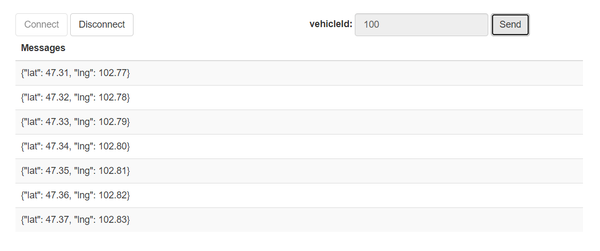

# SockJS Real-time Tracker

This is a twin project of [WebSocket Real-time Tracker](https://github.com/sing-fung/websocket-real-time-tracker).

It is a sockjs-server template that fetches data from MongoDB at regular intervals.

## Prerequisites
* Maven 3.6.0 or higher versions
* Java 11
* MongoDB 4.4.5 or higher versions

## Other frameworks
* SockJS
* STOMP
* Spring Boot
* Spring
* Sping MVC

## How to run this project
1. Clone this project on IntelliJ IDEA.
2. Run `\src\main\java\com\singfung\tracker\SockJSRealTimeTrackerApplication.java`.
3. Add some samples to MongoDB by running `\api-samples\saveGPS.http`. It adds the GPS information of two vehicles into MongoDB (`v100` and `v101`).
4. Open three tabs in a browser(`http://localhost:8080/v100.html`, `http://localhost:8080/v101.html` and `http://localhost:8080/v102.html`). Click `Connect` to start tracking and `Disconnect` to end it.